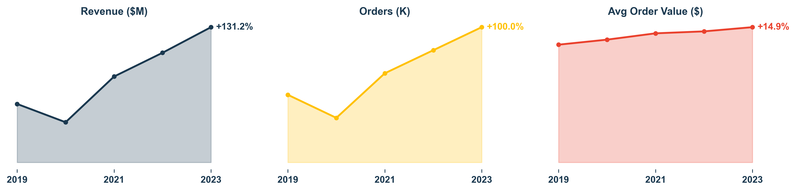
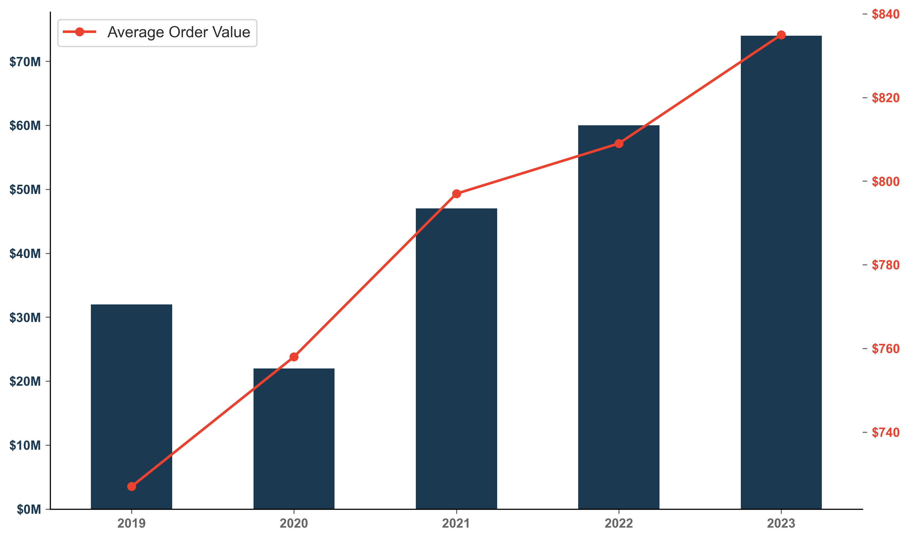
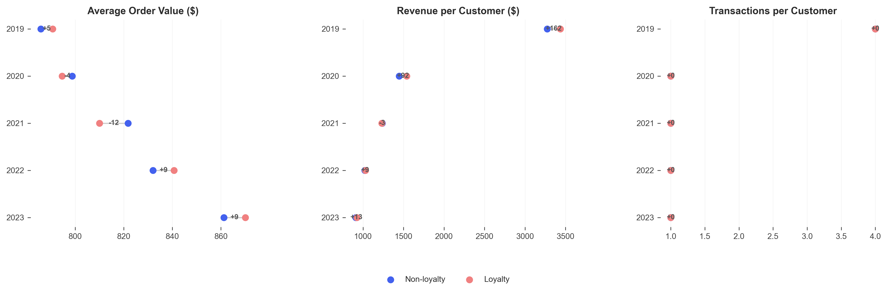
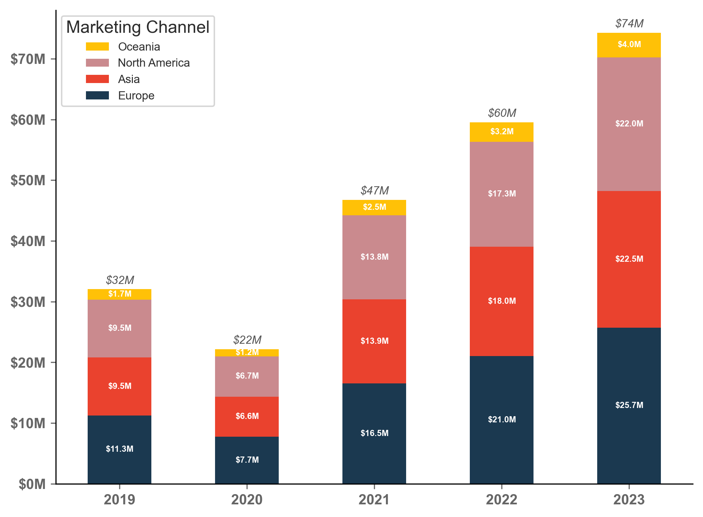
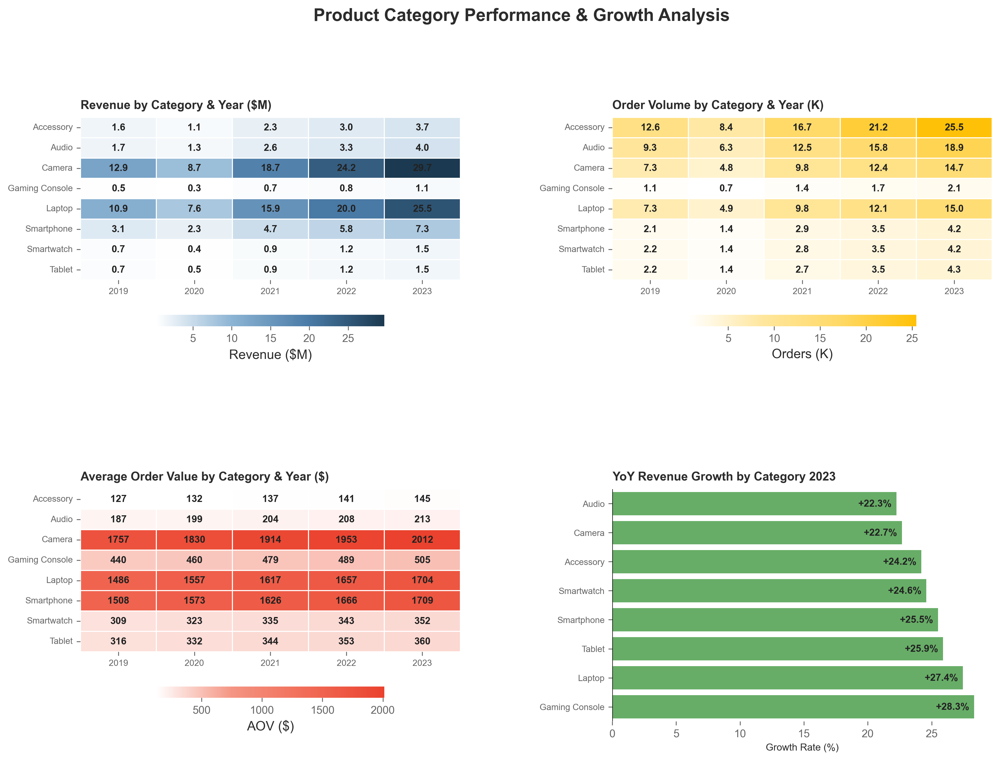
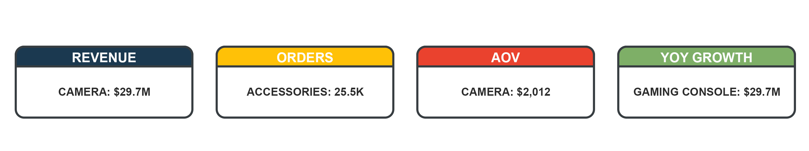
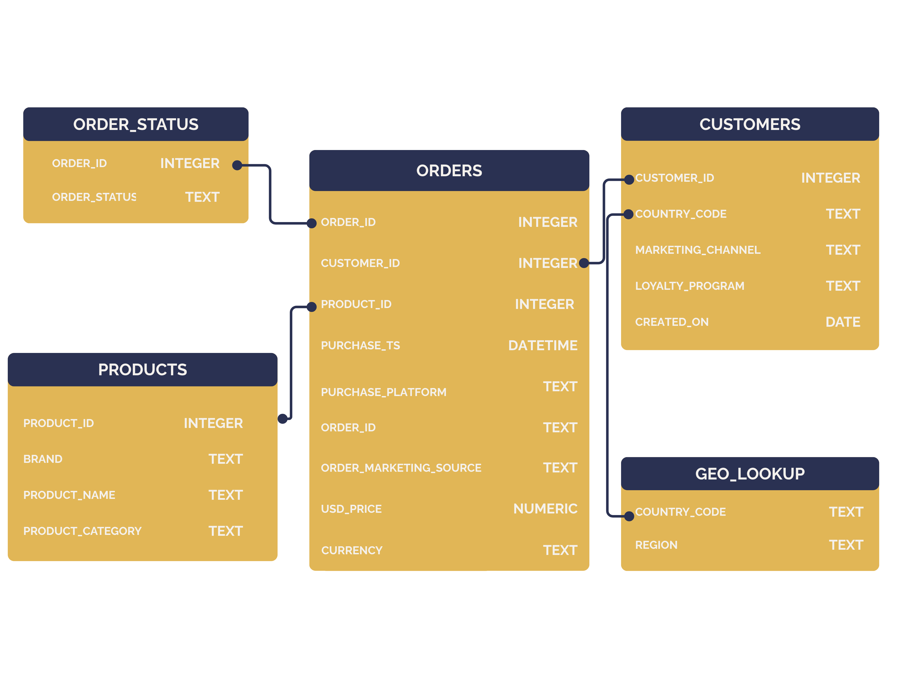

  

<h1 align="center">Retail E-commerce Performance Report</h1>
<table align="center">
  <td width="1440">
    <h2 align="center">Client Background</h2>
    

      <strong>TechHive</strong> is a U.S. based global electronics company serving customers across 8 countries and 4 major regions. Established as a digital-first retailer, the company has experienced rapid growth over the past five years, building a substantial customer base while navigating
      unique challenges including post-pandemic market corrections and intensifying competitive pressures.
    

    

      <strong>TechHive's</strong> current business portfolio encompasses <strong>102,000+</strong> customers across
      <strong>295,000+</strong> transactions, generating cumulative revenue exceeding <strong>$234.7 million</strong>.
      The company's product catalog spans 8 distinct categories from premium laptops and gaming equipment to volume
      accessories, serving diverse market segments with varying price sensitivities and purchasing behaviors.
    

    

      Reporting to the Head of Operations, this comprehensive analysis evaluated <strong>TechHive's</strong>
      performance across critical business dimensions over the 2019–2023 period. The analysis provides actionable
      insights for cross-functional teams to optimize customer acquisition strategies, enhance retention programs, and
      maximize revenue growth across regional markets. The key business areas examined include:
    

    <h3>Key Performance Indicators</h3>
    <ul>
      <li><strong>Customer Acquisition & Retention</strong> - Analyzing signup trends, cohort behavior, and transaction
        frequency patterns to identify critical retention challenges and growth opportunities.</li>
      <li><strong>Revenue Performance</strong> - Examining total revenue trends, average order values (AOV), and growth
        patterns across time periods to understand business trajectory and market positioning.</li>
      <li><strong>Loyalty Program Effectiveness</strong> - Evaluating customer loyalty program impact on purchase behavior,
        transaction frequency, and customer lifetime value to assess program ROI.</li>
      <li><strong>Regional Market Analysis</strong> - Assessing geographic performance variations, regional growth rates, and
        market penetration opportunities to inform expansion strategies.</li>
      <li><strong>Product Category Performance</strong> - Analyzing product mix effectiveness, category-level profitability,
        and inventory optimization opportunities across the electronics portfolio.</li>
    </ul>
  </td>
  </tr>
</table>

<table align="center">
  <tr>
    

      <h1 align="center">Executive Summary</h1>
      <h3 align="center">Sales and Customer Retention Analysis (2019–2023)</h3>
      

        
        
<em>Chart: sparkline charts showing Total Revenue, Total Order, and AOV growth from 2019-2023</em>

      

      <td width="460" valign="top">
        <ol>
          <li>
            <strong>Customer Acquisition Crisis:</strong>
            <ul>
              <li><strong>78% decline in new customer signups</strong> from pandemic peak (25K in 2020) to current
                levels (5K in 2023).</li>
              <li>Transaction frequency plummeted across all cohorts except the mysterious 2019 signup group, which
                maintains 4× higher engagement.</li>
              <li><strong>Social Media and email drive new customers</strong>, accounting for 60%+ of new purchasers in 2023.</li>
              <li><strong>Critical challenge:</strong> New customers exhibit 75% lower lifetime transaction rates compared to pre-2020
                cohorts.</li>
            </ul>
          </li>
          <li>
            <strong>Loyalty Program Ineffectiveness</strong>
            <ul>
              <li><strong>Zero measurable impact on customer behavior </strong> - loyalty and non-loyalty customers show identical
                transaction patterns and frequency.</li>
              <li>Despite 43% program enrollment, no difference in AOV growth, retention rates, or repeat purchase behavior
                between segments. </li>
              <li>Program represents <strong>untapped potential for additional incremental revenue</strong> through effective restructuring.</li>
            </ul>
          </li>
        </ol>
      </td>
      <td width="460" valign="top">
        <ol start="3">
          <li>
            <strong>Regional Growth Opportunities</strong>
            <ul>
              <li><strong>India market demonstrates 135% growth trajectory</strong> with revenue increasing from $6.4M
                to $15.1M from 2019-2023, representing the highest growth potential.</li>
             <li><strong>US is largest sales market</strong>, generating a quarter of total revenue in 2023 ($18M), and continuing to grow YoY (+28% 2022 to 2023).
              </li>   
            </ul>
          </li>
          <li>
            <strong>Operational Excellence & Strategic Priorities</strong>
            <ul>
              <li>Successfully scaled operations 2× (44K → 89K annual orders) while maintaining ~4% return rates,
                  demonstrating strong operational foundation.</li>
              <li><strong>Peak Revenue Period:</strong> August consistently delivers the highest monthly revenue (~$6.7M), suggesting seasonal peaks likely tied to back-to-school purchasing and promotional cycles</li>
              <li><strong>Operational Efficiency Gains:</strong> Despite a 2× increase in order volume from 2019 to 2023, cancellation rates declined 13% relative to 2019 levels, reflecting enhanced process control and fulfillment consistency.
              </li>
              <li><strong>Revenue concentration risk: </strong>Camera category represents 40% of total revenue despite comprising only
                17% of transactions.</li>
              <li><strong>Immediate priority:</strong> Solve 2019 cohort engagement mystery to restore baseline transaction frequency across all customer segments.</li>
            </ul>
          </li>
        </ol>
      </td>
    

  </tr>
</table>

<table align="center">
  <tr>
    <h1 align="center">Revenue and Sales Performance Overview</h1>
  

        <h4>
        <strong>Annual revenue, orders, and AOV (2019–2023), showing steady growth and improved efficiency.</strong>
      </h4>
    
    
<em>Chart: Annual Revenue (bars) and Average Order Value (line)</em>

  

  </tr>
</table>
<table>
  <tr>
    <td>
    <ul>
   <li> <strong>Sustained Growth Amid Market Shifts: </strong> From 2019 to 2023, TechHive achieved steady revenue expansion, increasing from <strong>$14M to $18M (+28%)</strong> despite global disruptions during pandemic period and slowing new customer growth. Order volume scaled from 44K to 89K, demonstrating significant operational maturity and consistent demand for high-value products.
   </li>

  <li> <strong>Improving Profitability and Pricing Power:</strong> Average Order Value <strong>(AOV) rose by 15% </strong> during the same period, supported by a stable product mix and successful upselling across premium categories such as laptops and cameras. Steady AOV growth alongside volume gains reflects the brand’s strong pricing power and loyal customer base.</li>

  <strong>Operational Reliability:</strong> Even as sales doubled, <strong>return rates remained near 4%</strong>, and <strong>cancellations improved 13%</strong>, highlighting operational efficiency and supply chain stability as key strengths in TechHive’s business model.</li>
 <ul>
    </td>
  </tr>
</table>

The following section summarizes revenue and pricing performance trends over the same period

<table align="center">
  <tr>
    <h1 align="center">Customer Acquisition & Cohort Analysis</h1>
    <td width="1000", align="center">
      <h4>
        <strong>New Customer Signups Have Plummeted Since 2020, and newer customers are far less likely to become repeat customers than pre-COVID acquisitions</strong>
      </h4>
      
      
<em>Chart: Annual customer signups (bars) and average transactions per cohort (line)</em>

    </td>
  </tr>
</table>

<table>
  <tr>
    <td>
      <strong>Customer Acquisition Trends</strong>
      <ol>
        <li>Pandemic-Driven Surge Followed by Severe Decline <ul>
            <li><strong>2020 represented peak acquisition performance</strong> with 25,000+ new customer signups, likely driven
              by global shift to e-commerce during pandemic period lockdowns.</li>
            <li>Post-pandemic correction resulted in <strong>consistent year-over-year declines</strong>, with 2023
              signups falling to just over 5,000 customers - a 78% reduction from peak levels.</li>
          </ul>
        </li>
        <li>2019 Cohort Engagement Benchmark <ul>
            <li> The 2019 customer cohort averages 4 transactions per customer, outperforming all other signup years by over 3×. This group represents a behavioral benchmark for TechHive’s retention and lifetime value strategies.</li>
            <li><strong>2019 customers maintain 4× higher transaction frequency</strong> compared to all subsequent
              signup cohorts, averaging 4 transactions per customer vs. 1 transaction for 2020-2023 cohorts.</li>
            <li>Solving this mystery represents the highest-impact opportunity, potential multi-million dollar revenue upside if 2019-level engagement were replicated.</li>
          </ul>
        </li>
          </ul>
        </li>
      </ol>
    </td>
  </tr>
</table>

<table align="center">
  <tr>
    <h1 align="center">Loyalty Program Analysis</h1>
    <table align="center">
      <tr align="center">
        <td width="1000">
          <h3>Loyalty Members Show No Significant Differences in AOV, Frequency, or Value</h3>
          
            
<em>Chart: three range plots showing loyalty vs non-loyalty member Average Order Value, Revenue Per Customer and Avg Transactions by signup year.</em>

        </td>
      </tr>
    </table>
    <table>
      <tr>
        <td>
          <ul>
            <li><strong>Zero Program Effectiveness:</strong> Comprehensive analysis reveals no significant
              difference in customer behavior between loyalty program participants and non-participants across all key
              metrics including AOV, transaction frequency, and retention rates.</li>
               
            <li><strong>Missed Revenue Opportunity:</strong> With 43% of customers enrolled in the loyalty program, the
              lack of behavioral differentiation represents a major untapped revenue opportunity through effective
              program redesign.</li>
                  
            <li><strong>Identical Spending Patterns:</strong> Both loyalty and non-loyalty customers exhibit similar AOV
              ranges ($790-800) and purchase frequency patterns (0.5 purchases annually), indicating
              program benefits provide no meaningful incentive for increased engagement.</li>
                  
            <li><strong>Strategic Recommendation:</strong> Complete program restructuring required, focusing on
              transaction frequency incentives rather than traditional discount-based rewards to drive measurable
              behavioral change and customer lifetime value improvement.</li>
          </ul>
        </td>
      </tr>
    </table>
  </tr>
</table>

<table align="center">
  <h1 align="center">Regional Performance</h1>
  

        <h4>
        <strong>Europe leads with ~33% share, while Asia and North America each contribute ~30% of total revenue.</strong>
      </h4>
    
    
<em>Chart: Stack bar chart showing total revenue by geographic region each year.</em>

  

  <tr valign="top">
    <td width="900">
    

    
Regional performance highlights reveal divergent maturity levels — with India driving growth, the US providing scale, and Australia defining a premium niche.
 
    

      <ul>
        <li><strong>India: High-Growth Market Leader</strong></li>
        <ul>
          <li>Demonstrates strongest growth trajectory with 135% revenue increase over analysis period.</li>
          <li>Revenue scaled from $6.4M (2019) to $15.1M (2023), representing $8.7M in incremental business.</li>
          <li>Market characteristics: High transaction volume, moderate AOV ($794), strong customer acquisition rates.
          </li>
        </ul>
        <li><strong>Australia: Premium Market Positioning</strong></li>
        <ul>
          <li>Highest average order value globally at $809+, driven by premium Camera category dominance.</li>
          <li>Lower transaction volume but exceptional per-customer revenue generation ($2,463 AVC).</li>
          <li>Market model may be suitable for replication in similar high-income, tech-savvy regions.</li>
        </ul>
        <li><strong>United States: Mature Market Challenges</strong></li>
        <ul>
          <li>Largest absolute revenue contributor ($18M total in 2023) with continued growth trajectory.</li>
          <li>Growth rate: +29% YoY from 2022 to 2023 (highest globally)</li>
          <li>Opportunity: Customer retention and loyalty program effectiveness critical for sustained performance.</li>
        </ul>
      </ul>
    </td>
  </tr>
</table>

<table align="center">
  <tr>
    <h1 align="center">Product Category Performance</h1>
    

      <h3>Category Revenue Distribution and Growth Patterns</h3>
      
    

        

      <h3>Category Leaders (2023)</h3>
      
    

  <tr>
  </tr>
</table>

<table align="center">
  <tr>
    <td width="333" valign="top">
      <h3>High-Performance Categories</h3>
      <ul>
        <li><strong>Camera Equipment</strong> dominates revenue generation with $94.2M total (40% of business) despite
          representing only 17% of transaction volume.</li>
        <li>Average order value of $1,922 makes Cameras the premium category driver, with <strong>consistent demand across all
          regions</strong>.</li>
        <li><strong>Laptop segment</strong> accounts for 34% of revenue with $80M total revenue and moderately high AOV ($1,628)</li>
        <li>Both categories demonstrate recession-resistant characteristics with steady growth and market-fit across regions</li>
      </ul>
    </td>
    <td width="333" valign="top">
      <h3>Growth Opportunity Categories</h3>
      <ul>
        <li><strong>Gaming consoles</strong> show strong momentum (+28% YoY), signaling a scalable growth category alongside established premium lines</li>
        <li><strong>Accessories</strong> and <strong>Audio equipment</strong> offer high-frequency purchase opportunities with lower AOV (~$150-200) but excellent customer acquisition potential in emerging markets and bundling opportunities.</li>
      </ul>
    </td>
  </tr>
</table>

<table align="center">
  <h1>Strategic Recommendations</h1>
  <h4>Based on comprehensive analysis findings, the following prioritized actions TechHive can pursue to improve KPIs</h4>
  <ul>
    <h3>Customer Acquisition & Retention</h3>
    <li><strong>Investigate 2019 cohort:</strong> further analysis to identify customer engagement factors and strategize replication to improve baseline transaction frequency across all cohorts.</li> 
    <ul>
      <!-- <li><strong>Potential Impact:</strong> +300% transaction frequency increase could generate $20M+ in recovered
        lifetime value.</li> -->
      <li><strong>Research Focus Area:</strong> Analyze 2019 onboarding processes, product mix, marketing channels, and customer service touchpoints for differentiating factors.</li>
    </ul>
    <li><strong>Acquisition Recovery Strategy:</strong> Implement targeted campaigns addressing the 78% decline in new customer signups since pandemic peak.</li>
    <ul>
      <!-- <li><strong>Target:</strong> Restore annual acquisition to 15K+ customers (pre-pandemic + growth baseline).</li> -->
      <li><strong>Recommended Channel Strategy:</strong> Diversify beyond traditional digital marketing (specifically paid search, which is declining in ROI) toward social-driven campaigns like influencer partnerships and referral programs.</li>
    </ul>
    <li><strong>Apply behavioral findings</strong> from the 2019 cohort as a template for new customer reactivation campaigns</li>
    <h3>Loyalty Program Restructuring</h3>
    <li><strong>Complete Program Overhaul:</strong> Redesign loyalty framework to drive measurable behavioral change,
      focusing on transaction frequency rather than discount-based rewards.</li>
    <ul>
      <li><strong>Recommended Strategy:</strong> 
      <ul>
      <li><strong>Tier-based system:</strong> Implement tier-based system with exclusive product access, expedited shipping, and personalized recommendations rather than traditional point accumulation.</li>
      <li><strong>Frequency-based rewards:</strong> Test incentives for repeat purchases (e.g. 3rd order ships free).</li>
      <li><strong>Data-Driven Personalization:</strong> Leverage 2019 cohort engagement findings to create personalized customer incentives for loyalty program participants.</li>
    </ul>
    </ul>
      <h3>Geographic Expansion & Market Optimization</h3>
      <li><strong>India Market Acceleration:</strong> Double down on 135% growth trajectory with dedicated market
        investment and localized strategies.
      </li>
      <li><strong>US market retention:</strong> Continue to optimize for efficiency and retention in U.S. market, focusing on incentives for repeat purchases to leverage customer base.
      </li>
    </ul>
    <ul>
    <h3>Product Portfolio & Revenue Diversification</h3>
    <li><strong>Category Expansion Strategy:</strong> Reduce revenue concentration risk by developing adjacent high-value categories beyond Camera (40% dependency) and Laptop (34% dependency) dominance.</li>
    <ul>
      <li> Research recent increased demand for gaming consoles in larger markets to keep momentum.</li>
      <li><strong>Test product bundling</strong> with cross revenue and volume categories (e.g. Cameras + Accessories)</li>
    </ul>
  </ul>
   
  
Overall, TechHive’s growth story combines strong operational fundamentals with clear strategic focus areas — reigniting acquisition, revitalizing loyalty, and balancing revenue dependency across regions and categories

</table>
<h2 align="left">APPENDIX: Dataset Structure and ERD</h2>

<body>The comprehensive sales database consists of five primary tables: orders, customers, products, geo_lookup,

  

<em>Chart: Entity Relationship Diagram for TechHive dataset</em>
